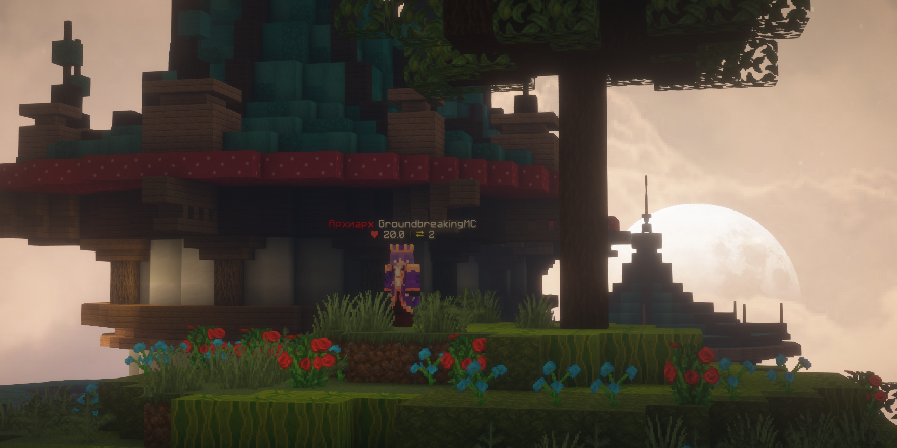

# ModernTags



Современный плагин для отображения кастомных тегов над головами игроков с использованием Text Display entities.

## Основной функционал

- **Кастомизация тегов** - полная настройка внешнего вида тегов (цвет, тени, прозрачность, выравнивание, размер и т.д.)
- **Анимированные теги** - поддержка нескольких фреймов с настраиваемой скоростью смены
- **Система приоритетов** - автоматический выбор тега на основе прав игрока с учётом приоритета
- **Интеграция с PlaceholderAPI** - поддержка любых плейсхолдеров из PAPI
- **Интеграция с Vault** - автоматическая вставка префиксов и суффиксов
- **Гибкие настройки обновления** - раздельная настройка частоты обновления фреймов и плейсхолдеров

## Технические преимущества

Плагин работает полностью асинхронно в Netty потоках через PacketEvents. Все данные кешируются в памяти для быстрого
доступа при повторных операциях, что обеспечивает высокую производительность даже на серверах с большим количеством
игроков.

## Команды и права

### Команды

- `/moderntags` - перезагрузка конфигурации плагина

### Права

- `moderntags.tag.<название>` - право на использование конкретного тега (генерируется автоматически)
- `moderntags.see.own` - видимость собственного тега
- `moderntags.see.other` - видимость тегов других игроков
- `moderntags.reload` - доступ к команде перезагрузки

## Плейсхолдеры

Плагин поддерживает следующие встроенные плейсхолдеры:

- `<placeholder:prefix>` - префикс игрока из Vault
- `<placeholder:suffix>` - суффикс игрока из Vault
- `<placeholder:name>` - имя игрока
- `<placeholder:display_name>` - отображаемое имя игрока
- `<placeholder:health>` - здоровье игрока

### PlaceholderAPI

Для использования плейсхолдеров из PlaceholderAPI используйте формат:

```
<placeholder:EXPANSION_PLACEHOLDER>
```

Примеры:

- `<placeholder:player_level>` - уровень игрока
- `<placeholder:vault_rank>` - ранг игрока
- `<placeholder:player_ping>` - пинг игрока

## Конфигурация

### Основные настройки

```yaml
# Использовать MiniMessage для форматирования префиксов и суффиксов из Vault
use-minimessage-colorizer-for-prefixes-and-suffixes: false

# Скрывать тег, когда на игроке есть пассажиры (например, другой игрок)
hide-tag-when-has-passenger: false
```

### Настройка тегов

```yaml
name-tags:
  default: # Тег по умолчанию (обязателен)
    frame-update-rate: 10  # Частота смены фреймов (в тиках), -1 для отключения
    placeholders-update-rate: 10  # Частота обновления плейсхолдеров (в тиках)
    priority: 0  # Приоритет тега (чем выше, тем приоритетнее)
    frames:
      0: # Первый фрейм
        text: |-
          <placeholder:prefix><white><placeholder:name><placeholder:suffix>
          <red>❤ <white><placeholder:health>
        # Параметры отображения
        shadowed: true
        y-offset: 0.2
        background-color: "00000000"

  vip: # Дополнительный тег для VIP игроков
    frame-update-rate: 20
    placeholders-update-rate: 5
    priority: 10  # Выше приоритет, чем у default
    frames:
      0:
        text: "<gold>⭐ VIP ⭐<newline><placeholder:name>"
        shadowed: true
        scale: 1.2
```

### Параметры фреймов

#### Текст и позиционирование

- `text` - текст тега (поддерживает MiniMessage форматирование и плейсхолдеры)
- `x-offset` - смещение по оси X (число)
- `y-offset` - смещение по оси Y (число, по умолчанию: 0.2)
- `z-offset` - смещение по оси Z (число)
- `scale` - масштаб тега (число, по умолчанию: 1.0)

#### Визуальные эффекты

- `shadowed` - тень текста (true/false)
- `shadow-radius` - радиус тени (число)
- `shadow-strength` - интенсивность тени (число)
- `see-through` - видимость сквозь блоки (true/false)
- `background-color` - цвет фона в формате HEX (#RRGGBB или #AARRGGBB) или число
- `text-opacity` - прозрачность текста (число от -1 до 255)
- `default-background` - стандартный фон Minecraft (true/false)

#### Настройки отображения

- `alignment` - выравнивание текста (LEFT, CENTER, RIGHT)
- `line-width` - максимальная ширина строки (число, по умолчанию: 200)
- `vertical-billboard` - вертикальный billboard (true/false)
- `view-range` - дальность видимости (число, по умолчанию: 1.0)
- `brightness` - яркость в формате "тип-сила", например:
    - `block-15` - максимальная яркость блока
    - `sky-15` - максимальная яркость неба

### Пример анимированного тега

```yaml
name-tags:
  animated:
    frame-update-rate: 20  # Смена фрейма каждую секунду
    placeholders-update-rate: 5
    priority: 5
    frames:
      0:
        text: "<gradient:red:yellow>✦ <placeholder:name> ✦"
        scale: 1.0
      1:
        text: "<gradient:yellow:red>✧ <placeholder:name> ✧"
        scale: 1.1
      2:
        text: "<gradient:red:yellow>✦ <placeholder:name> ✦"
        scale: 1.0
```

## Зависимости

### Обязательные

- **PacketEvents** - для работы с пакетами

### Опциональные

- **PlaceholderAPI** - для использования плейсхолдеров из других плагинов
- **Vault** - для работы с префиксами и суффиксами

## Поддержка

- **Minecraft версии**: 1.19.4+
- **Платформы**: Paper, Purpur и форки Paper

## Лицензия

[Apache License Version 2.0, January 2004](LICENSE)
